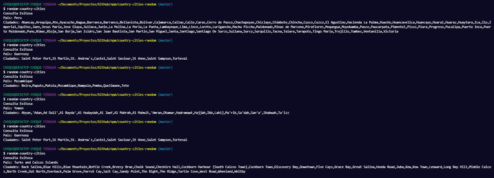

# random-country-cities

Este proyecto, se realizo a modo de practica, para aprender a realizar un paquete/dependencia para npm.
Devuelve a modo de consola,bash de forma Random un Pais con sus ciudades respectivas sea el caso.

Para este package, se usa la API de [COUNTRIES | NOW](https://countriesnow.space/), que nos permite obtener los datos necesarios como pais y ciudades.

## Install

```npm
npm install -g random-country-cities
```

# Usage

```bash
random-country-cities
```

# Screenshot



# Contributing
If someone wants to add or improve something, I invite you to collaborate directly in this repository: [random-country-cities](https://github.com/cesarchoqueskater/random-country-cities)

# License
random-msg is released under the [MIT License](https://opensource.org/licenses/MIT).